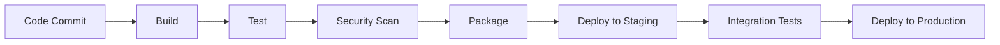

Continuous Integration and Continuous Deployment (CI/CD) is the backbone of modern software development. Having implemented CI/CD pipelines across multiple organizations, I'll share practical strategies for building robust, scalable automation that delivers code from development to production safely and efficiently.

## The CI/CD Foundation

### Why CI/CD Matters

**Without CI/CD:**
- Manual deployments prone to human error
- Inconsistent environments between dev and production
- Long feedback cycles for bug detection
- Fear of releasing new features

**With CI/CD:**
- Automated testing catches issues early
- Consistent, repeatable deployments
- Faster time to market
- Reduced deployment risk

### Core Principles

1. **Automate Everything**: From code commit to production deployment
2. **Fail Fast**: Catch issues as early as possible in the pipeline
3. **Keep Pipelines Fast**: Optimize for quick feedback loops
4. **Make it Visible**: Clear status and logging for all stakeholders
5. **Security by Design**: Integrate security scanning throughout

## Pipeline Architecture Patterns

### Basic CI/CD Flow


### Multi-Environment Strategy
```yaml
# Pipeline stages across environments
stages:
  - build
  - unit-test
  - security-scan
  - package
  - deploy-dev
  - integration-test
  - deploy-staging
  - e2e-test
  - deploy-production
  - smoke-test
```

## Jenkins Pipeline Implementation

### Declarative Pipeline
```groovy
pipeline {
    agent any
    
    environment {
        DOCKER_REGISTRY = 'your-registry.com'
        APP_NAME = 'myapp'
        KUBECONFIG = credentials('kubeconfig')
    }
    
    stages {
        stage('Checkout') {
            steps {
                checkout scm
                script {
                    env.GIT_COMMIT_SHORT = sh(
                        script: 'git rev-parse --short HEAD',
                        returnStdout: true
                    ).trim()
                }
            }
        }
        
        stage('Build') {
            steps {
                script {
                    def image = docker.build("${DOCKER_REGISTRY}/${APP_NAME}:${env.GIT_COMMIT_SHORT}")
                    docker.withRegistry("https://${DOCKER_REGISTRY}", 'docker-registry-credentials') {
                        image.push()
                        image.push('latest')
                    }
                }
            }
        }
        
        stage('Test') {
            parallel {
                stage('Unit Tests') {
                    steps {
                        sh 'npm test -- --coverage --watchAll=false'
                    }
                    post {
                        always {
                            publishTestResults testResultsPattern: 'test-results.xml'
                            publishCoverageResults(
                                adapters: [coberturaAdapter('coverage/cobertura-coverage.xml')],
                                sourceFileResolver: sourceFiles('STORE_LAST_BUILD')
                            )
                        }
                    }
                }
                
                stage('Lint') {
                    steps {
                        sh 'npm run lint'
                    }
                }
                
                stage('Security Scan') {
                    steps {
                        sh 'npm audit --audit-level moderate'
                        script {
                            def trivyResult = sh(
                                script: "trivy image --exit-code 1 --severity HIGH,CRITICAL ${DOCKER_REGISTRY}/${APP_NAME}:${env.GIT_COMMIT_SHORT}",
                                returnStatus: true
                            )
                            if (trivyResult != 0) {
                                error("Security vulnerabilities found!")
                            }
                        }
                    }
                }
            }
        }
        
        stage('Deploy to Staging') {
            steps {
                script {
                    sh """
                        helm upgrade --install ${APP_NAME}-staging ./helm-chart \\
                            --namespace staging \\
                            --set image.tag=${env.GIT_COMMIT_SHORT} \\
                            --set environment=staging \\
                            --wait --timeout=300s
                    """
                }
            }
        }
        
        stage('Integration Tests') {
            steps {
                sh 'npm run test:integration -- --env=staging'
            }
        }
        
        stage('Deploy to Production') {
            when {
                branch 'main'
            }
            steps {
                input message: 'Deploy to production?', ok: 'Deploy'
                script {
                    sh """
                        helm upgrade --install ${APP_NAME} ./helm-chart \\
                            --namespace production \\
                            --set image.tag=${env.GIT_COMMIT_SHORT} \\
                            --set environment=production \\
                            --wait --timeout=600s
                    """
                }
            }
        }
        
        stage('Smoke Tests') {
            steps {
                sh 'npm run test:smoke -- --env=production'
            }
        }
    }
    
    post {
        always {
            cleanWs()
        }
        success {
            slackSend(
                channel: '#deployments',
                color: 'good',
                message: "✅ ${APP_NAME} v${env.GIT_COMMIT_SHORT} deployed successfully to production"
            )
        }
        failure {
            slackSend(
                channel: '#deployments',
                color: 'danger',
                message: "❌ ${APP_NAME} deployment failed. Check: ${env.BUILD_URL}"
            )
        }
    }
}
```

## GitLab CI Implementation

### Complete .gitlab-ci.yml
```yaml
variables:
  DOCKER_DRIVER: overlay2
  DOCKER_TLS_CERTDIR: "/certs"
  REGISTRY: $CI_REGISTRY_IMAGE
  KUBECONFIG: /tmp/kubeconfig

stages:
  - build
  - test
  - security
  - package
  - deploy-staging
  - test-staging
  - deploy-production

# Build stage
build:
  stage: build
  image: docker:20.10.16
  services:
    - docker:20.10.16-dind
  before_script:
    - docker login -u $CI_REGISTRY_USER -p $CI_REGISTRY_PASSWORD $CI_REGISTRY
  script:
    - docker build -t $REGISTRY:$CI_COMMIT_SHA .
    - docker push $REGISTRY:$CI_COMMIT_SHA
  only:
    - branches

# Test stage
unit-tests:
  stage: test
  image: node:18-alpine
  cache:
    paths:
      - node_modules/
  script:
    - npm ci
    - npm run test:coverage
  coverage: '/Lines\s*:\s*(\d+\.\d+)%/'
  artifacts:
    reports:
      junit: test-results.xml
      coverage_report:
        coverage_format: cobertura
        path: coverage/cobertura-coverage.xml
    expire_in: 1 week

lint:
  stage: test
  image: node:18-alpine
  cache:
    paths:
      - node_modules/
  script:
    - npm ci
    - npm run lint
    - npm run format:check

# Security stage
dependency-scan:
  stage: security
  image: node:18-alpine
  script:
    - npm audit --audit-level moderate
  allow_failure: true

container-scan:
  stage: security
  image: aquasec/trivy:latest
  script:
    - trivy image --exit-code 1 --severity HIGH,CRITICAL $REGISTRY:$CI_COMMIT_SHA
  dependencies:
    - build

sast:
  stage: security
  image: securecodewarrior/gitlab-sast:latest
  script:
    - /analyzer run
  artifacts:
    reports:
      sast: gl-sast-report.json

# Package stage
package:
  stage: package
  image: docker:20.10.16
  services:
    - docker:20.10.16-dind
  before_script:
    - docker login -u $CI_REGISTRY_USER -p $CI_REGISTRY_PASSWORD $CI_REGISTRY
  script:
    - docker pull $REGISTRY:$CI_COMMIT_SHA
    - docker tag $REGISTRY:$CI_COMMIT_SHA $REGISTRY:latest
    - docker push $REGISTRY:latest
  only:
    - main

# Staging deployment
deploy-staging:
  stage: deploy-staging
  image: bitnami/kubectl:latest
  before_script:
    - echo $KUBE_CONFIG | base64 -d > $KUBECONFIG
  script:
    - |
      helm upgrade --install myapp-staging ./helm-chart \
        --namespace staging \
        --create-namespace \
        --set image.repository=$REGISTRY \
        --set image.tag=$CI_COMMIT_SHA \
        --set environment=staging \
        --wait --timeout=300s
  environment:
    name: staging
    url: https://staging.myapp.com
  only:
    - main

# Staging tests
integration-tests:
  stage: test-staging
  image: node:18-alpine
  script:
    - npm ci
    - npm run test:integration -- --baseUrl=https://staging.myapp.com
  dependencies:
    - deploy-staging
  only:
    - main

# Production deployment
deploy-production:
  stage: deploy-production
  image: bitnami/kubectl:latest
  before_script:
    - echo $KUBE_CONFIG | base64 -d > $KUBECONFIG
  script:
    - |
      helm upgrade --install myapp ./helm-chart \
        --namespace production \
        --create-namespace \
        --set image.repository=$REGISTRY \
        --set image.tag=$CI_COMMIT_SHA \
        --set environment=production \
        --set replicaCount=3 \
        --wait --timeout=600s
  environment:
    name: production
    url: https://myapp.com
  when: manual
  only:
    - main
```

## GitHub Actions Implementation

### Complete Workflow
```yaml
name: CI/CD Pipeline

on:
  push:
    branches: [ main, develop ]
  pull_request:
    branches: [ main ]

env:
  REGISTRY: ghcr.io
  IMAGE_NAME: ${{ github.repository }}

jobs:
  build-and-test:
    runs-on: ubuntu-latest
    outputs:
      image-digest: ${{ steps.build.outputs.digest }}
    
    steps:
    - name: Checkout code
      uses: actions/checkout@v4
    
    - name: Set up Node.js
      uses: actions/setup-node@v4
      with:
        node-version: '18'
        cache: 'npm'
    
    - name: Install dependencies
      run: npm ci
    
    - name: Run linting
      run: npm run lint
    
    - name: Run tests
      run: npm run test:coverage
    
    - name: Upload coverage reports
      uses: codecov/codecov-action@v3
      with:
        file: ./coverage/lcov.info
    
    - name: Set up Docker Buildx
      uses: docker/setup-buildx-action@v3
    
    - name: Log in to Container Registry
      uses: docker/login-action@v3
      with:
        registry: ${{ env.REGISTRY }}
        username: ${{ github.actor }}
        password: ${{ secrets.GITHUB_TOKEN }}
    
    - name: Extract metadata
      id: meta
      uses: docker/metadata-action@v5
      with:
        images: ${{ env.REGISTRY }}/${{ env.IMAGE_NAME }}
        tags: |
          type=ref,event=branch
          type=ref,event=pr
          type=sha,prefix={{branch}}-
    
    - name: Build and push Docker image
      id: build
      uses: docker/build-push-action@v5
      with:
        context: .
        push: true
        tags: ${{ steps.meta.outputs.tags }}
        labels: ${{ steps.meta.outputs.labels }}
        cache-from: type=gha
        cache-to: type=gha,mode=max

  security-scan:
    runs-on: ubuntu-latest
    needs: build-and-test
    
    steps:
    - name: Run Trivy vulnerability scanner
      uses: aquasecurity/trivy-action@master
      with:
        image-ref: ${{ env.REGISTRY }}/${{ env.IMAGE_NAME }}:${{ github.sha }}
        format: 'sarif'
        output: 'trivy-results.sarif'
    
    - name: Upload Trivy scan results
      uses: github/codeql-action/upload-sarif@v2
      with:
        sarif_file: 'trivy-results.sarif'

  deploy-staging:
    runs-on: ubuntu-latest
    needs: [build-and-test, security-scan]
    if: github.ref == 'refs/heads/main'
    environment: staging
    
    steps:
    - name: Checkout code
      uses: actions/checkout@v4
    
    - name: Configure kubectl
      uses: azure/k8s-set-context@v3
      with:
        method: kubeconfig
        kubeconfig: ${{ secrets.KUBE_CONFIG }}
    
    - name: Deploy to staging
      run: |
        helm upgrade --install myapp-staging ./helm-chart \
          --namespace staging \
          --create-namespace \
          --set image.repository=${{ env.REGISTRY }}/${{ env.IMAGE_NAME }} \
          --set image.tag=${{ github.sha }} \
          --set environment=staging \
          --wait --timeout=300s

  integration-tests:
    runs-on: ubuntu-latest
    needs: deploy-staging
    
    steps:
    - name: Checkout code
      uses: actions/checkout@v4
    
    - name: Set up Node.js
      uses: actions/setup-node@v4
      with:
        node-version: '18'
        cache: 'npm'
    
    - name: Install dependencies
      run: npm ci
    
    - name: Run integration tests
      run: npm run test:integration
      env:
        BASE_URL: https://staging.myapp.com

  deploy-production:
    runs-on: ubuntu-latest
    needs: [deploy-staging, integration-tests]
    if: github.ref == 'refs/heads/main'
    environment: production
    
    steps:
    - name: Checkout code
      uses: actions/checkout@v4
    
    - name: Configure kubectl
      uses: azure/k8s-set-context@v3
      with:
        method: kubeconfig
        kubeconfig: ${{ secrets.KUBE_CONFIG }}
    
    - name: Deploy to production
      run: |
        helm upgrade --install myapp ./helm-chart \
          --namespace production \
          --create-namespace \
          --set image.repository=${{ env.REGISTRY }}/${{ env.IMAGE_NAME }} \
          --set image.tag=${{ github.sha }} \
          --set environment=production \
          --set replicaCount=3 \
          --wait --timeout=600s
    
    - name: Run smoke tests
      run: |
        sleep 30
        curl -f https://myapp.com/health || exit 1
```

## Advanced Pipeline Patterns

### Blue-Green Deployment
```yaml
# Blue-Green deployment script
deploy-blue-green:
  script:
    - |
      # Deploy to inactive environment
      ACTIVE=$(kubectl get service myapp-active -o jsonpath='{.spec.selector.version}')
      if [ "$ACTIVE" = "blue" ]; then
        INACTIVE="green"
      else
        INACTIVE="blue"
      fi
      
      # Deploy new version to inactive environment
      helm upgrade --install myapp-$INACTIVE ./helm-chart \
        --set image.tag=$CI_COMMIT_SHA \
        --set version=$INACTIVE \
        --wait
      
      # Run health checks
      kubectl wait --for=condition=ready pod -l version=$INACTIVE --timeout=300s
      
      # Switch traffic
      kubectl patch service myapp-active -p '{"spec":{"selector":{"version":"'$INACTIVE'"}}}'
      
      # Cleanup old version after successful deployment
      sleep 60
      helm uninstall myapp-$ACTIVE
```

### Canary Deployment
```yaml
# Canary deployment with Istio
deploy-canary:
  script:
    - |
      # Deploy canary version
      helm upgrade --install myapp-canary ./helm-chart \
        --set image.tag=$CI_COMMIT_SHA \
        --set version=canary \
        --set replicaCount=1
      
      # Configure traffic split (10% to canary)
      kubectl apply -f - <<EOF
      apiVersion: networking.istio.io/v1beta1
      kind: VirtualService
      metadata:
        name: myapp
      spec:
        http:
        - match:
          - headers:
              canary:
                exact: "true"
          route:
          - destination:
              host: myapp
              subset: canary
        - route:
          - destination:
              host: myapp
              subset: stable
            weight: 90
          - destination:
              host: myapp
              subset: canary
            weight: 10
      EOF
```

## Pipeline Optimization Strategies

### Parallel Execution
```yaml
# Optimize with parallel jobs
test:
  stage: test
  parallel:
    matrix:
      - TEST_SUITE: [unit, integration, e2e]
        NODE_VERSION: [16, 18, 20]
  script:
    - npm ci
    - npm run test:$TEST_SUITE
```

### Caching Strategies
```yaml
# GitLab CI caching
cache:
  key: ${CI_COMMIT_REF_SLUG}
  paths:
    - node_modules/
    - .npm/
  policy: pull-push

# Docker layer caching
build:
  script:
    - docker build --cache-from $CI_REGISTRY_IMAGE:latest -t $CI_REGISTRY_IMAGE:$CI_COMMIT_SHA .
```

### Conditional Execution
```yaml
# Skip unnecessary stages
deploy:
  script:
    - echo "Deploying..."
  rules:
    - if: $CI_COMMIT_BRANCH == "main"
      changes:
        - src/**/*
        - Dockerfile
        - helm-chart/**/*
```

## Monitoring and Observability

### Pipeline Metrics
```yaml
# Collect pipeline metrics
after_script:
  - |
    curl -X POST "http://prometheus-pushgateway:9091/metrics/job/gitlab-ci/instance/$CI_JOB_ID" \
      --data-binary @- <<EOF
    gitlab_ci_job_duration_seconds{job="$CI_JOB_NAME",stage="$CI_JOB_STAGE"} $CI_JOB_DURATION
    gitlab_ci_job_status{job="$CI_JOB_NAME",stage="$CI_JOB_STAGE"} $CI_JOB_STATUS
    EOF
```

### Deployment Tracking
```bash
# Track deployments in monitoring
curl -X POST "http://grafana:3000/api/annotations" \
  -H "Authorization: Bearer $GRAFANA_API_KEY" \
  -H "Content-Type: application/json" \
  -d '{
    "text": "Deployed version '$CI_COMMIT_SHA' to production",
    "tags": ["deployment", "production"],
    "time": '$(date +%s000)'
  }'
```

## Best Practices and Lessons Learned

### Pipeline Design
1. **Keep it Simple**: Start with basic pipelines and add complexity gradually
2. **Fail Fast**: Put quick tests early in the pipeline
3. **Parallel When Possible**: Run independent tasks concurrently
4. **Cache Aggressively**: Cache dependencies and build artifacts
5. **Make it Visible**: Clear logging and status reporting

### Security Integration
1. **Shift Left**: Security scanning early in the pipeline
2. **Secrets Management**: Never hardcode secrets in pipeline files
3. **Image Scanning**: Scan container images for vulnerabilities
4. **Dependency Checking**: Regular dependency vulnerability scans

### Deployment Strategies
1. **Environment Parity**: Keep environments as similar as possible
2. **Rollback Plan**: Always have a quick rollback strategy
3. **Health Checks**: Comprehensive health checking after deployment
4. **Gradual Rollout**: Use blue-green or canary deployments for critical services

## Troubleshooting Common Issues

### Pipeline Failures
```bash
# Debug failed jobs
gitlab-runner exec docker job-name

# Check resource constraints
kubectl top nodes
kubectl top pods

# Review logs
kubectl logs -f deployment/myapp
```

### Performance Issues
```bash
# Analyze pipeline duration
curl -H "PRIVATE-TOKEN: $GITLAB_TOKEN" \
  "https://gitlab.com/api/v4/projects/$PROJECT_ID/pipelines?per_page=100" | \
  jq '.[] | {id: .id, duration: .duration, status: .status}'
```

CI/CD is not just about automation—it's about building confidence in your deployment process. Start with the basics, measure everything, and continuously improve your pipelines based on real-world feedback and metrics.

What CI/CD challenges have you encountered? Share your pipeline optimization strategies in the comments!